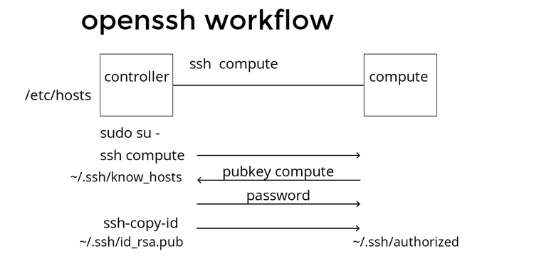

name: inverse
layout: true
class: center, middle, inverse
---
## Install Openstack with Packstack
---
layout: false
## RDO project
### What is rdo project
https://www.rdoproject.org/
https://www.rdoproject.org/install/quickstart/
https://wiki.openstack.org/wiki/Puppet
---
## workshop Openstack
- vagrantfile in traning/openstack1
- open Vagrantfile and understand it

```bash
vagrant ssh controller
sudo su -
systemctl stop firewalld
systemctl disable NetworkManager
systemctl stop NetworkManager
systemctl enable network
systemctl start network

yum install -y centos-release-openstack-mitaka
yum update -y
yum install -y openstack-packstack
```
---
## ssh keytransfer (passwordless login)
Set up sshkey in controller node and send public key to compute node
because openstack will install from controller node to compute node
so we need 'passwordless login'
```bash
## enable password login
vi /etc/ssh/sshd_config +79
PasswordAuthentication yes
systemctl restart sshd
##Gen key id_rsa.pub
ssh-keygen -t rsa -b 4096 -C "openstack"
ls ~/.ssh/
id_rsa  id_rsa.pub
##1  Transfer public key to compute
ssh-copy-id compute
#(root passwd is 'linux')
## Test
ssh compute
exit
##2 Transfer public key to self(controller)
ssh-copy-id controller
#(root passwd is 'linux')
## Test
ssh controller
exit
```
---
## ssh keytransfer


---
## Create Volume groups
crate volume groups name 'cinder-volumes' for cinder as block storage
```bash
pvcreate /dev/vdb
fdisk /dev/vdb
n
p
1
enter
enter
w

partprobe
vgcreate cinder-volumes /dev/vdb1

  Physical volume "/dev/vdb1" successfully created
  Volume group "cinder-volumes" successfully created

```
---
## packstack
packstack is command line to install openstack
-  packstack --install-hosts=CONTROLLER_ADDRESS,COMPUTE_ADDRESSES

```bash
packstack --version
packstack --install-hosts=10.10.10.10,10.10.10.11 \
--provision-demo=n \
--nagios-install=n \
--os-neutron-ovs-bridge-mappings=extnet:br-ex,physnet1:br-eth2 \
--os-neutron-ovs-bridge-interfaces=br-ex:eth0,br-eth2:eth2 \
--os-neutron-ml2-type-drivers=vxlan,flat,local,vlan \
--os-neutron-ml2-vlan-ranges=physnet1:1000:2000 \
--os-heat-install=y --os-heat-cfn-install=y \
--os-sahara-install=y --os-trove-install=y \
--os-neutron-lbaas-install=y \
--keystone-admin-passwd=linux
```
## run second time
**  packstack --answer-file=packstack-answers-xxxxxxxxx.txt
