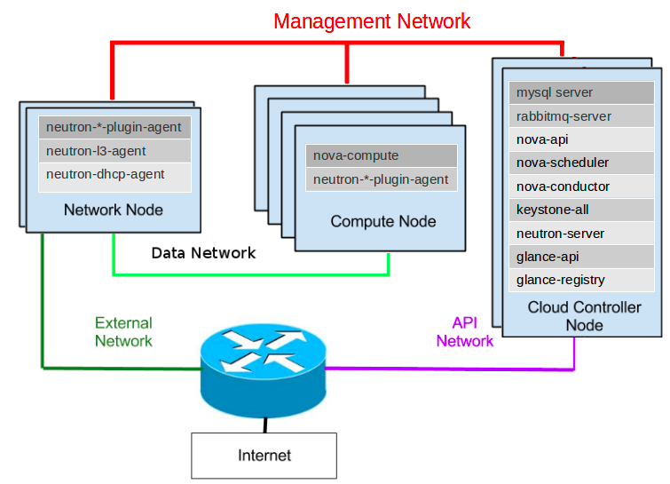
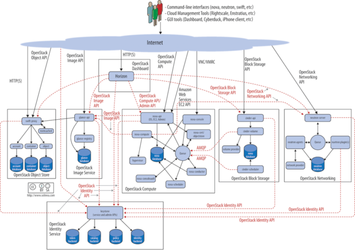
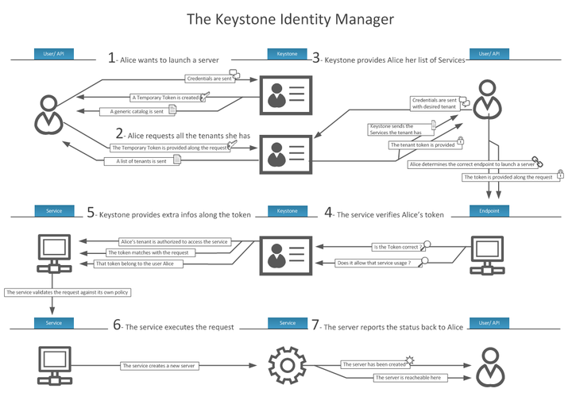
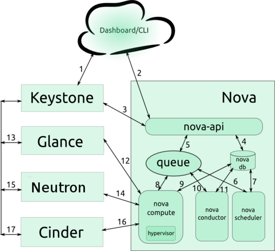
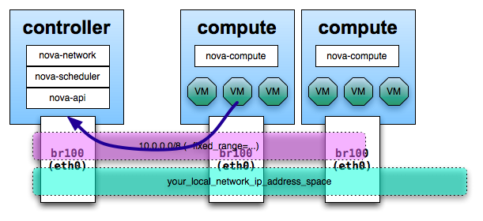
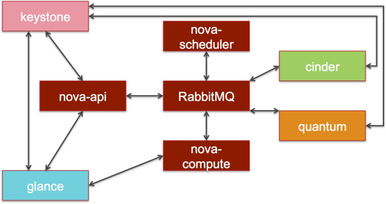
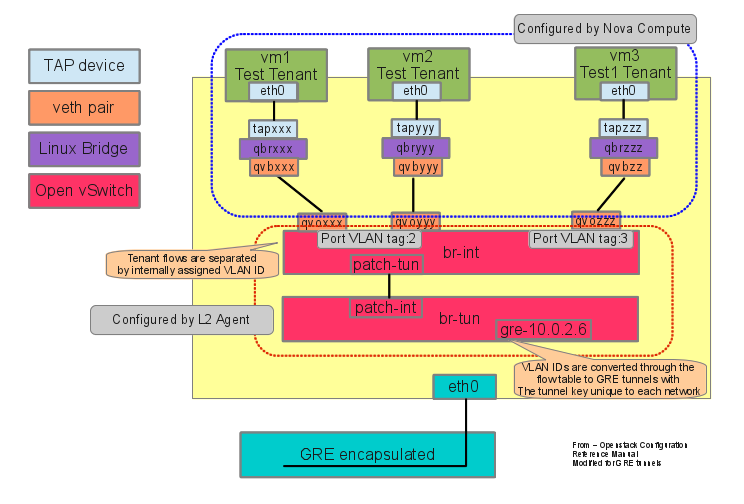
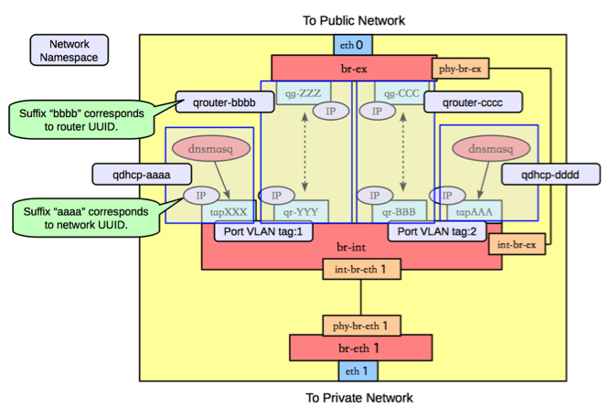
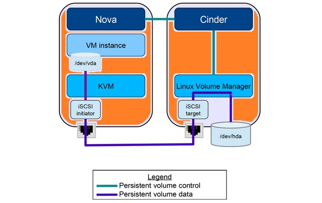
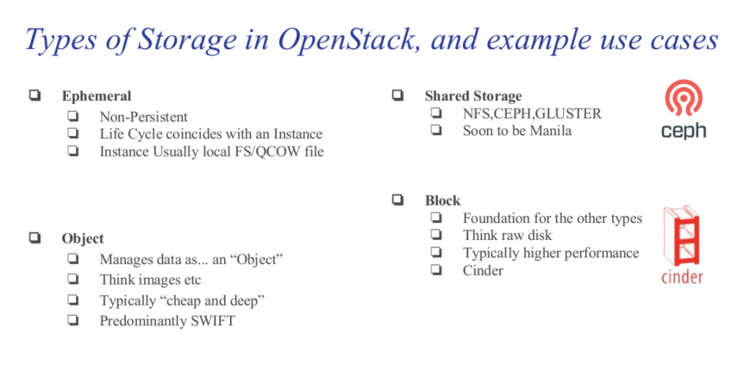

name: inverse
layout: true
class: center, middle, inverse
---
## Install Openstack with Packstack
---
layout: false
## RDO project
### What is rdo project
- https://www.rdoproject.org/
- https://www.rdoproject.org/install/quickstart/
- https://wiki.openstack.org/wiki/Puppet
---
## workshop Openstack
- vagrantfile in traning/openstack1
- open Vagrantfile and understand it

```bash
vagrant ssh controller
sudo su -
systemctl stop firewalld
systemctl disable NetworkManager
systemctl stop NetworkManager
systemctl enable network
systemctl start network

yum install -y centos-release-openstack-mitaka
yum update -y
yum install -y openstack-packstack
```
---
## ssh keytransfer (passwordless login)
Set up sshkey in controller node and send public key to compute node
because openstack will install from controller node to compute node
so we need 'passwordless login'
```bash
## enable password login
vi /etc/ssh/sshd_config +79
PasswordAuthentication yes
systemctl restart sshd
##Gen key id_rsa.pub
ssh-keygen -t rsa -b 4096 -C "openstack"
ls ~/.ssh/
id_rsa  id_rsa.pub
##1  Transfer public key to compute
ssh-copy-id compute
#(root passwd is 'linux')
## Test
ssh compute
exit
##2 Transfer public key to self(controller)
ssh-copy-id controller
#(root passwd is 'linux')
## Test
ssh controller
exit
```
---
## ssh keytransfer


---
## Create Volume groups
crate volume groups name 'cinder-volumes' for cinder as block storage
```bash
fdisk /dev/vdb
n
p
1
enter
enter
w

partprobe

pvcreate /dev/vdb1
vgcreate cinder-volumes /dev/vdb1

  Physical volume "/dev/vdb1" successfully created
  Volume group "cinder-volumes" successfully created

```
---
## packstack
packstack is command line to install openstack
-  packstack --install-hosts=CONTROLLER_ADDRESS,COMPUTE_ADDRESSES

```bash
packstack --version
packstack --install-hosts=10.10.10.10,10.10.10.11 \
--provision-demo=n \
--nagios-install=n \
--os-neutron-ovs-bridge-mappings=extnet:br-ex,physnet1:br-eth2 \
--os-neutron-ovs-bridge-interfaces=br-ex:eth0,br-eth2:eth2 \
--os-neutron-ml2-type-drivers=vxlan,flat,local,vlan \
--os-neutron-ml2-vlan-ranges=physnet1:1000:2000 \
--os-heat-install=y --os-heat-cfn-install=y \
--os-sahara-install=y --os-trove-install=y \
--os-neutron-lbaas-install=y \
--cinder-volumes-create=n \
--keystone-admin-passwd=linux
```
## run second time
**  packstack --answer-file=packstack-answers-xxxxxxxxx.txt
---
## Lab3 node
- training/openstack2/
```bash
packstack --version
packstack --install-hosts=10.10.10.10,10.10.10.11,10.10.10.12
--nagios-install=n \
 \
--provision-demo=n \
--nagios-install=n \
--os-neutron-ovs-bridge-mappings=extnet:br-ex,physnet1:br-eth2 \
--os-neutron-ovs-bridge-interfaces=br-ex:eth0,br-eth2:eth2 \
--os-neutron-ml2-type-drivers=vxlan,flat,local,vlan \
--os-neutron-ml2-vlan-ranges=physnet1:1000:2000 \
--os-heat-install=y --os-heat-cfn-install=y \
--os-sahara-install=y --os-trove-install=y \
--os-neutron-lbaas-install=y \
--cinder-volumes-create=n \
--keystone-admin-passwd=linux
```
---
## Open docs.openstack.org
- http://docs.openstack.org/mitaka/install-guide-rdo/
---
## Install openstack client [on host]
```bash
## install packages
sudo dnf install python-{openstack,keystone,nova,neutron,glance,cinder,\
swift,heat,ceilometer}client
## create folder
cd ~ && mkdir openstackrc && cd openstackrc
##create file
cat << RC > admin_rc_v2
unset OS_SERVICE_TOKEN
export OS_USERNAME=admin
export OS_PASSWORD=linux
export OS_AUTH_URL=http://10.10.10.10:5000/v2.0
export PS1='[\u@\h \W(keystone_admin)]\$ '
export OS_TENANT_NAME=admin
export OS_REGION_NAME=RegionOne
RC
## Test
source admin_rc_v2
openstack user list
```
---
## Get  V3
```bash
##prepare folder
cd ~ && mkdir openstackrc_v3 && cd openstackrc_v3
```
From menu on left, select(open openstack web)
- Project > Compute > Access & Security
- Select Api Access tab
    - Download Openstack RC File V3 save 'admin-openrc.sh' on host in
    ~/openstackrc_v3/

verify 3 line:
    - export OS_IDENTITY_API_VERSION=3
    - export OS_AUTH_VERSION=3
    - export OS_PROJECT_DOMAIN_NAME="Default"

```bash
## test v3 on host
cd ~/openstackrc_v3/
source admin-openrc.sh
openstack user list
```
---
## lab keystone
### Create a domain, projects, users, and roles
- Create the default domain
- Create the admin project:
- Create the admin user:
- Create the admin role:
- Add the admin role to the admin project and user:

```bash
$ openstack project create  demo2
+-------------+----------------------------------+
| Field       | Value                            |
+-------------+----------------------------------+
| description | None                             |
| enabled     | True                             |
| id          | ce352b6caacb44899e58953f47537857 |
| name        | demo2                            |
+-------------+----------------------------------+

```
---
## create user demo2
```bash
openstack user create --password-prompt demo2
User Password:
Repeat User Password:
+----------+----------------------------------+
| Field    | Value                            |
+----------+----------------------------------+
| email    | None                             |
| enabled  | True                             |
| id       | d65a86eee08841c488d75f4f296ecf22 |
| name     | demo2                            |
| username | demo2                            |
+----------+----------------------------------+
```
### add user to project with role _memeber_

```bash
openstack role add --project demo2 --user demo2 _member_
+-----------+----------------------------------+
| Field     | Value                            |
+-----------+----------------------------------+
| domain_id | None                             |
| id        | 9fe2ff9ee4384b1894a90878d3e92bab |
| name      | _member_                         |
+-----------+----------------------------------+

```
## Every user / service must be in project
```bash
openstack project list
+----------------------------------+----------+
| ID                               | Name     |
+----------------------------------+----------+
| 45ff66b9fcaa45e9874325110080559b | services |
| 81504adb59c44135bae443c1c0832615 | demo     |
| a1d6310f642642fa9139bcfe5aeffe67 | admin    |
| ce352b6caacb44899e58953f47537857 | demo2    |
+----------------------------------+----------+

openstack service list
+----------------------------------+---------------+-----------------+
| ID                               | Name          | Type            |
+----------------------------------+---------------+-----------------+
| 4dc22ebe433645ecaa414850ad5e435c | swift         | object-store    |
| 5301884c9f48461db329e2574ed9bd68 | aodh          | alarming        |
| 7d6549f07fa346e3897dfd9d79323ec4 | novav3        | computev3       |
| 81b4bac5729145bfb699ba5cae71cbef | nova          | compute         |
| 87200b01706d4daab1d97933063bcab5 | gnocchi       | metric          |
| 896fc188693d415cb52af544980d7ec8 | neutron       | network         |
| 950f791108364199ac1883f297770944 | sahara        | data-processing |
| a6c21c17aa894b179dde052072e21d2e | cinderv2      | volumev2        |
| a8ed962c9e5e44559bc7204a95424dae | trove         | database        |
...
```
---
## Install


---
## Architecture
- [full size](images/packstack.png)



---
## Keystone - Security is Critical
- [full size keystone](images/identity-diagram.png)

---
## Workflow

---
## Nova component

---
## Nova intercommunication
Nova compute is the OpenStack component that orchestrates the creation and deletion of compute/VM instances.

---
## Nova Component
The core components of Nova include the following:

- The "nova-api" accepts and responds to end-user compute API calls. It also initiates most of the orchestration activities (such as running an instance) as well as enforcing some policies.

- The "nova-compute" process is primarily a worker daemon that creates and terminates virtual machine instances via hypervisor APIs (XenAPI for XenServer/XCP, libvirt for KVM or QEMU, VMwareAPI for vSphere, etc.).

- The "nova-scheduler" process is conceptually the simplest piece of code in OpenStack Nova: it takes a virtual machine instance request from the queue and determines where it should run (specifically, which compute node it should run on).

---
## Neutron


<!--
Looking at VM1, when it is created the VM's eth0 interface is connected to a Linux tap device tapxxx which is plugged into a newly created Linux bridge, qbrxxx. Into this bridge one end of a virtual Ethernet pair (qvbxxx) is attached and the other half of the veth pair (qvoxxx) is placed into the OVS process. The setup is more complicated than the older Nova security group configuration, which plugged the tap interface directly into the OVS process. This setup has the advantage that packets can be filtered when passing into or out of the Linux bridge. The packets now transverse the iptables FORWARD chain on the compute node and filters can be applied into this chain. This is a big improvement to Nova security group rules since this technique will filter any packets passing into or out of a specific VM. Formerly using Nova security group rules, iptables filtering occurred within the network namespace on the network node. Traffic going between VMs on the same subnet would not pass through the network node or be filtered which could potentially allow a compromised VM to attack other VMs on the same subnet.
-->
---
## br-ex

---
## Cinder Architecture


---
## Storage Type


---
